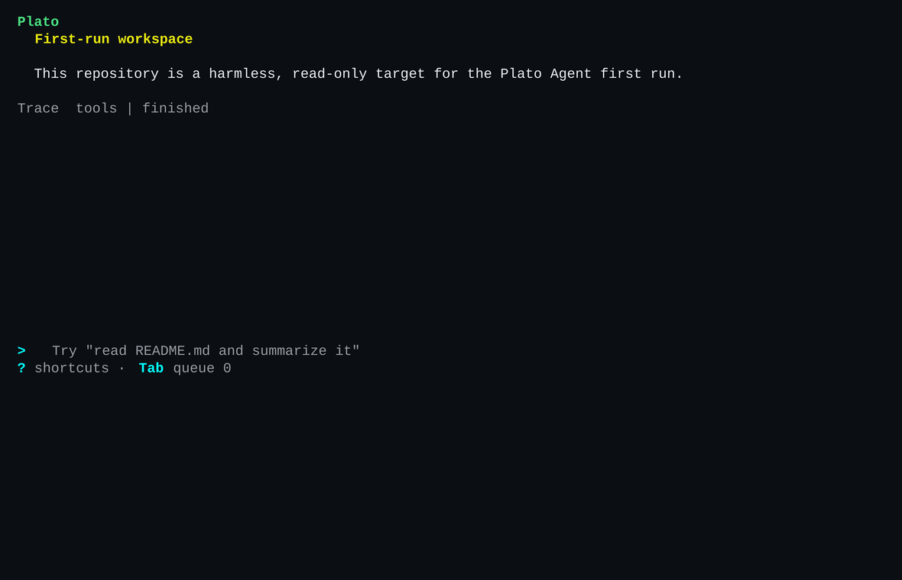

# Plato Agent

The reference agent runtime for the Platonic framework.

**Platonic**

*by Referential.ai*

Plato Agent is the named application built on the Platonic framework. It shows
its work: every step is recorded, replayable, and auditable.

The workspace [naming authority](https://github.com/referential-ai/platonic-workspace/blob/main/product/branding.md)
owns the hierarchy and exact forms.

**New here? Start with [docs/QUICKSTART.md](docs/QUICKSTART.md) — build, run, and test in five minutes.**

Existing crate, repository, library, command, config, state, and release
identities remain unchanged.

The bootstrap surface is intentionally small:

- Bare `plato` in a terminal ensures the persistent workspace daemon and opens the TUI.
- `plato "question"` runs directly when no daemon is serving, or delegates the same default-ledger run to a live daemon.
- `plato -c "follow-up"` continues the latest workspace session from the SQLite ledger.
- `plato --events <file> "question"` writes an explicit JSONL ledger.
- `plato replay <file>` validates and prints a deterministic JSONL readback without network calls or tool execution.
- `plato replay [--run <id>]` replays the default SQLite ledger; omitted `--run` selects the latest session.
- `plato replay --db[=<path>] [--run <id>]` replays an explicit SQLite ledger.
- `plato issue-prep start <run-dir>` runs the fixed issue preparation pipeline from Markdown on stdin.
- `plato daemon` runs the current workspace daemon in the foreground.
- `plato gateway discord` checks that daemon, then runs the Discord connector.

## Configuration

Config resolution order:

1. `--config <path>`
2. `$PLATO_CONFIG`
3. `./plato.toml`
4. `~/.config/plato/config.toml` on Unix or `%APPDATA%\plato\config.toml` on Windows
5. built-in defaults

Auto-discovered `./plato.toml` cannot set `provider.api_key_env`,
`provider.base_url`, or any `[gateway]` table. Use `--config`, `$PLATO_CONFIG`,
or the user config for provider credentials, custom endpoints, and gateway
trust settings.

Leading `~` expands in explicit config paths. Relative explicit paths resolve
against the workspace root. Built-in defaults use OpenRouter:

```toml
[provider]
kind = "open_router"
model = "~openai/gpt-latest"
api_key_env = "OPENROUTER_API_KEY"
connect_timeout_ms = 30000
stream_idle_timeout_ms = 120000

[limits]
token_budget = 4000
max_output_tokens = 1024
max_turns = 8

[tools]
enabled = ["file.read", "file.list", "file.write", "file.edit", "shell.exec"]
```

OpenAI-compatible direct OpenAI config remains available:

```toml
[provider]
kind = "open_ai"
model = "gpt-5.5"
api_key_env = "OPENAI_API_KEY"
```

`connect_timeout_ms` bounds each socket connection and request write.
`stream_idle_timeout_ms` bounds each response read, so continued response
progress receives a fresh idle window. The legacy `timeout_ms` name remains an
alias for `stream_idle_timeout_ms`; setting both names is an error. Cancelable
runs poll for cancellation during stalled response-body reads on a fixed
100-millisecond interval without shortening that configured idle window.

A completion POST rejected with HTTP 429 before any response body or streaming
delta retries once and records the failed attempt plus repeated request at the
same turn and step. A finite, nonnegative numeric `Retry-After` of at most 30
seconds is honored; a missing or invalid value waits one second, and a value
over 30 seconds is not retried. Cancellation before the 429 is handled, and
cancellation during the retry wait prevents the second request event and POST.
Once the second request boundary is crossed, cancellation does not retract that
POST and is observed at the existing response boundary. Other provider failures
are not retried.

`file.read` and `file.list` are auto-allowed. `file.write`, `file.edit`, and
`shell.exec` require stdin approval and default to no. `shell.exec` runs from
the workspace root with a scrubbed child environment, no provider credentials,
bounded stdout/stderr, and a timeout. It uses `sh -c` on Unix and
`cmd.exe /C` on Windows; timeout or cancellation terminates the full process tree.
Use `--yolo` to auto-approve enabled workspace-write tools that would otherwise
prompt. Yolo mode does not enable disabled or unknown tools, approve network
tools, permit deny-class effects such as external side effects or secret access,
approve `shell.exec`, auto-approve direct changes to root `PLATONIC.md`, or
bypass workspace path checks.

## Workspace Memory

If `<workspace-root>/PLATONIC.md` exists, Plato Agent snapshots its exact
contents once at run start and includes that snapshot in every model turn for
the run. Only that exact filename at the workspace root is recognized; aliases
such as `PLATO.md` and files below the root are ignored. A missing file leaves
provider requests unchanged.

`PLATONIC.md` must be a regular file containing valid UTF-8 and no more than
8,192 bytes. The final path component is opened without following symlinks,
and content is never trimmed. Workspace memory counts against the context
budget; older session turns may be dropped to make room, but the memory
snapshot is not shortened. Changes made after a run starts apply to the next
run, not later turns in the current run.

Direct `file.write` and `file.edit` calls to this reserved file always require
approval, including under `--yolo`. The complete proposed content is checked
against the same UTF-8 and 8,192-byte limits before either tool writes; failed
validation leaves an existing or absent target unchanged.

## Issue Preparation

Issue preparation is one fixed pipeline: prepare, refine, then model review.
Each stage writes its prompt, reads that file for the model request, records the
result, and writes a hash-bound validation record. Rust enforces response shape
and structural invariants; the final review is model-authored and is not
independent semantic proof. There are no tools, retries, loops, or configurable
nodes.

```bash
cat issue.md | cargo run --bin plato -- issue-prep start \
  .plato/issue-prep/issue-123
```

From the TUI, submit `/issue-prep <rough issue>`. The daemon runs the same
pipeline and returns the candidate or blocked reasons in the transcript.
An animated elapsed indicator remains visible while it runs. Artifacts are
written under `.plato/issue-prep/<run_id>/`.
The TUI keeps connection setup and `hello` on its three-second deadline, then
waits for the synchronous pipeline to finish under its existing provider bounds.

`start` requires a new run directory. A failed run remains unchanged; retry
with a different directory. A successful candidate is written to stdout and
`40-candidate.md`. A structurally blocked stage or model review with findings
exits nonzero and leaves its reasons in the stage validation file.

Every run uses this exact convention:

```text
00-manifest.json
01-input.md
10-prepare.prompt.md
11-prepare.result.json
12-prepare.validation.json
20-refine.prompt.md
21-refine.result.json
22-refine.validation.json
30-review.prompt.md
31-review.result.json
32-review.validation.json
40-candidate.md
```

## SQLite Ledgers

- Bare `plato "..."` writes to the default platform user-state path.
- `plato -c "..."` continues the latest session from that store.
- `--db` also writes to the default platform user-state path.
- `--db=<path>` writes to that SQLite file; relative paths resolve against the current workspace.
- On Unix, default ledger directories are `0700` and the database and SQLite sidecars are `0600`; explicit `--db=<path>` permissions remain caller-managed.
- Use `=` for explicit paths because `--db` also has a bare default form.
- Live assistant text, `run_id`, `ledger_path`, and replay hints print to stderr. Stdout remains only the final answer.
- Replay shows final assistant messages, not partial streaming deltas.
- Replay renders dropped oldest session turns as `[<turn_id>] context_compacted estimated_tokens=<before>-><after> dropped_turns=<start>..<end>`; the zero-based range has an exclusive end and the token values are host estimates of the complete context before and after compaction.
- Ledger, approval, replay, and typed-transcript tool call ids are host-minted per run; provider ids remain provider-facing.
- Streamed runs request provider usage chunks. Usage is recorded only when the
  provider reports both token counts; reported zeros remain known, while
  omitted or partial usage is recorded as unknown.
- `plato replay` without arguments replays the latest session from the default platform SQLite ledger.
- `plato replay --run <id>` replays a single run.
- `--events <file>` is the explicit JSONL export/debug path.
- Read-only SQLite replay reads `user_version` first: schema v1 uses only
  `ledger_events`, schema v2 keeps session selection, and newer schemas fail
  without migration. Write-open remains the sole v1-to-v2 migration path.
- With a live workspace daemon, default-ledger prompts delegate to it. Replay,
  explicit `--db=<path>`, and direct `--yolo` SQLite paths remain direct and
  fail closed if they conflict with the daemon-owned store.
- Direct SQLite CLI operations hold the workspace lock before session lookup or
  database open through final output, then release it when the CLI exits.
- SQLite session terminal events and their matching outcomes commit together.
  Daemon startup replays running session ledgers, reconciling an existing
  terminal event or recording one interruption failure before closing the run.

Replay forms:

```bash
cargo run --bin plato -- replay
cargo run --bin plato -- replay --db
cargo run --bin plato -- replay --db=/tmp/plato-agent.db
cargo run --bin plato -- replay --db=/tmp/plato-agent.db --run run_123
```

## Daemon

`plato-agentd` is the local runtime daemon for session-facing clients such as
`plato` and `plato-tui`. The runtime topology and verb set are defined in
[`docs/ARCHITECTURE.md`](docs/ARCHITECTURE.md#runtime-topology) and issue
[#11](https://github.com/referential-ai/plato-agent/issues/11).

Start it in the foreground for the current workspace:

```bash
plato daemon
```

This delegates to the same-revision sibling `plato-agentd` and preserves its
terminal, signals, output, and exit result. The direct
`plato-agentd --workspace "$PWD"` technical command remains supported.

On startup it prints:

```text
workspace_id: <workspace-id>
socket_path: <daemon-endpoint>
ledger_path: <state-path>/agent.db
```

Default paths are keyed by the workspace id:

- Unix socket: `${XDG_RUNTIME_DIR:-<system-temp>/plato-agent-<uid>}/plato-agent/workspaces/<workspace-id>/agent.sock`
- Unix lock: `${XDG_RUNTIME_DIR:-<system-temp>/plato-agent-<uid>}/plato-agent/workspaces/<workspace-id>/agent.lock`
- Unix ledger: `${XDG_STATE_HOME:-$HOME/.local/state}/plato-agent/workspaces/<workspace-id>/agent.db`
- Windows pipe: `\\.\pipe\plato-agent-<workspace-id>`
- Windows lock and ledger: `%LOCALAPPDATA%\plato-agent\workspaces\<workspace-id>\agent.lock` and `agent.db`

Runtime directories are restricted to `0700` and the daemon socket to `0600`.
A custom Unix `--socket` parent is restricted to `0700` at startup. Windows
pipe and lock ACLs grant access only to the current user and reject remote pipe
clients. Windows clients limit server impersonation to identity inspection,
authenticate the server's user before sending protocol bytes, and bound
busy-pipe connection waits.

The daemon holds the workspace lock while it is active. On Unix, the lock is a
persistent current-user `0600` regular file guarded by a nonblocking exclusive
kernel advisory lock. Startup validates the file without following symlinks,
then rewrites its diagnostic metadata only after acquiring the kernel lock.
Normal and abrupt exits release the kernel lock but leave the file in place, so
lock probes use kernel ownership rather than path existence. SIGINT and SIGTERM
on Unix, and Ctrl-C or Ctrl-Break on Windows, trigger a graceful shutdown: the
daemon stops accepting new connections, then removes its endpoint before
exiting. On Windows the daemon creates the exact lock file with delete-on-close
and holds its handle for the daemon lifetime, so normal or abrupt exit removes
the path. Do not remove a lock for a live daemon. Ordinary Windows daemon
startup may wait up to five seconds for a valid installer or update gate
owner to release or abandon the gate. Invalid ownership or a timeout causes
startup to fail closed before the daemon creates its endpoint or workspace lock.
Live assistant deltas are transient `events.stream` events and are not written
to the ledger. After a `lagged` response, omitting `from_offset` resumes at the
current tip; `transcript.read` returns ledger-backed status and final answer.
The collector drains every queued run event into the contiguous-offset buffer
before `finished`, `failed`, or `canceled` can be observed.
An accepted `run.cancel` stores `cancel_requested` before replying. Repeated
requests return that state without another cancellation event, while terminal
runs reject cancellation.
The daemon retains event buffers for the newest 32 terminal runs in completion
order. Older runs return `not_found` from `events.stream`; `transcript.read` and
`sessions.list` remain ledger-backed.
`hello` advertises `transcript.read.typed`. Successful `transcript.read`
responses preserve the legacy `transcript` string and add ordered `typed.runs`
with structured chat, tool, policy, and approval entries.
`hello` also advertises `transcript.read.pending_approval`; while a run is
paused, its transcript response includes the complete pending approval and
omits it immediately after a decision or cancellation.
`hello` advertises `daemon.shutdown_if_idle` for graceful control. The request
omits `params` (an empty object is also accepted). It returns `refused_active`
without changing the daemon while a run or approval is active; otherwise it
closes run admission, returns `shutdown`, then exits and removes its socket and
lock. Duplicate shutdown and run-admission requests dispatched before teardown
fail with `daemon_shutting_down`; after the `shutdown` response, connection
close is expected and lock removal confirms success.

On Windows, installer control validates every current-user lock against its
workspace and live process image. Exact sidecars also require the expected pipe
server PID and `hello` response before control:

```powershell
plato-agentd control list-workspaces
plato-agentd control shutdown-if-idle --workspace C:\path\to\workspace
plato-agentd control shutdown-if-idle
```

The commands emit NDJSON. The aggregate shutdown validates the whole namespace
before sending any shutdown request, attempts every validated daemon, and exits
nonzero if a daemon is active or any lock cannot be validated. Locks are never
removed by the control client. A missing targeted daemon reports `not_running`;
a `shutdown` result is sent once and confirmed by process exit and lock removal.

Minimal NDJSON-over-Unix-socket check, using the `workspace_id` and
`socket_path` printed by the daemon:

```bash
WORKSPACE_ROOT="$PWD" \
WORKSPACE_ID="<workspace-id>" \
SOCKET_PATH="<socket-path>" \
python3 - <<'PY'
import json
import os
import socket

def send(file, request):
    file.write(json.dumps(request) + "\n")
    file.flush()
    print(file.readline(), end="")

with socket.socket(socket.AF_UNIX) as sock:
    sock.connect(os.environ["SOCKET_PATH"])
    file = sock.makefile("rw")
    send(file, {
        "v": 1,
        "id": "hello_1",
        "kind": "request",
        "method": "hello",
        "params": {
            "workspace_root": os.environ["WORKSPACE_ROOT"],
            "workspace_id": os.environ["WORKSPACE_ID"],
        },
    })
    send(file, {
        "v": 1,
        "id": "sessions_1",
        "kind": "request",
        "method": "sessions.list",
    })
PY
```

NDJSON `run.start` and `message.append` default to `wait: false`, returning a
`running` response immediately. Send `"wait": true` only when the connection can
block until the run finishes.
The TUI, desktop shell, embedded-daemon CLI probe, and Discord gateway bound
daemon connects and each complete request to three seconds. The desktop uses a
fresh budget for hello and every normal read or mutation.

## Local Dogfood Deployment

From a clean `develop` checkout, refresh the current-user binaries with:

```bash
./scripts/deploy-local.sh
```

The command fetches `origin/develop`, requires local `develop` to equal it,
builds the three locked release binaries, and installs them at
`~/.local/lib/plato-agent/{plato,plato-agentd,plato-tui}-real`. Existing wrapper
scripts are not changed. It prints before/after checksums, gracefully retires
only an owner-validated idle installed daemon, and verifies a new isolated
daemon hello plus TUI snapshot before completing the atomic set replacement.

Dirty, detached, non-`develop`, ahead, behind, failed-build, incomplete-stage,
invalid-daemon, active-daemon, and failed-readback cases fail closed without
changing the installed set. The immediately previous complete set is retained
at `~/.local/lib/plato-agent.rollback`; restore all three binaries together
with:

```bash
./scripts/deploy-local.sh --rollback
```

Deployed hello and TUI identity is `version commit UTC-date`. Builds made
outside the deploy command report `unknown` provenance explicitly.

## Desktop (Development)

The Plato Agent root and desktop packages require Rust 1.88. Platonic Core
remains on Rust 1.85.

The desktop shell renders full typed session history, streams the selected run,
and supports new or continued messages, approval decisions, and cancel.
Provider credentials remain with the daemon. Linux development attaches to a
manually started daemon. On Windows, the shell first attaches to a valid daemon
for the selected workspace; when none is listening, it starts the absolute
sibling `plato-agentd.exe` sidecar and retries for a bounded interval.



```bash
# Terminal 1, from the repository root
cargo run --bin plato-agentd -- --workspace "$PWD"

# Terminal 2
cd desktop
npm ci
npm run tauri:dev
```

On first launch, choose the daemon workspace. The shell remembers its canonical
path as the next-launch seed and returns to the picker if that directory
disappears; each running shell keeps its own selected root. **New chat** clears
the selected session; otherwise the composer continues it. Switching chats does
not cancel their active runs. Closing the Windows shell never stops a daemon or
run. The ready shell checks daemon health without restarting it; a child crash
shows the disconnected screen, and only **Reconnect** attempts one new start.
The shell never removes a daemon lock, and reports the endpoint and lock paths
when startup remains blocked. Only one Windows shell may own a workspace at a
time. Linux development requires the
[Tauri system dependencies](https://v2.tauri.app/start/prerequisites/#linux).

### Windows Installer (Unsigned Development)

Phase A targets x64 Windows 10 22H2 or newer. Build the per-user NSIS installer
on Windows:

```powershell
cd desktop
npm ci
npm run tauri:bundle:windows
```

The installer retains its technical `Plato` identity under `%LOCALAPPDATA%`,
bundles the same-revision `plato-agentd.exe`, and downloads the WebView2
Evergreen bootstrapper when the runtime is absent. Upgrade and uninstall first
close the desktop, block new installed-sidecar starts, and make one bounded
aggregate `plato-agentd control shutdown-if-idle` invocation. An active daemon or
unvalidated lock aborts before installed binaries or user files change;
idle daemons exit and remove their locks. These unsigned artifacts are for
development proof only and are not distributed.

### Linux AppImage (Private Release)

Linux releases target x86-64 Ubuntu 24.04 on the WebKitGTK 4.1 ABI. The
AppImage contains the same-revision `plato-agentd` sidecar. It first attaches
to a valid workspace daemon; if none is available, it restores only the user's
login-shell `PATH`, starts the bundled sidecar, and retries for a bounded
interval. Closing Plato Agent detaches without stopping the daemon or active runs.
Startup failures report the sidecar, socket, and lock paths and never delete a
lock or fall back to a system daemon.

Authenticated private-release download and integrity check:

```bash
gh auth status
gh release download plato-desktop-v0.1.0 \
  --repo referential-ai/plato-agent \
  --pattern 'Plato-*-x86_64.AppImage*'
sha256sum --check Plato-*-x86_64.AppImage.sha256
chmod +x Plato-*-x86_64.AppImage
./Plato-*-x86_64.AppImage
```

Ubuntu 24.04 needs its WebKitGTK 4.1 runtime and `libfuse2t64`; Rust, Node,
and development packages are not runtime dependencies. These private artifacts
are not a public community launch. Build the AppImage on Ubuntu 24.04 with
`npm run tauri:bundle:linux -- --ci -- --locked` from `desktop/`.

## Discord Gateway

`plato-gateway-discord` receives Discord messages over an outbound WebSocket
and sends replies through Discord's REST API. Add the bot token variable name
and numeric owner user ids to an authorized config:

```toml
[gateway.discord]
api_key_env = "DISCORD_BOT_TOKEN"
owner_user_ids = [123456789]

[gateway.discord.channel_configs]
"111111111111111111" = "~/.config/plato/channels/news.toml"
```

The entire `[gateway]` table is accepted only from `--config`, `PLATO_CONFIG`,
or the user config, not auto-discovered workspace `plato.toml`.
`channel_configs` must contain at least one positive numeric channel ID and is
the allowlist for messages and interactions, including DMs by their channel ID.
Unmapped channels are ignored before input scanning, daemon access, Discord
response work, or channel session and override changes. Each mapped file is an
ordinary Plato config and may omit `[gateway]`. Mapped paths are resolved and
validated when the gateway starts, so mapping changes require a restart. The
daemon loads the selected file for each fresh or continued run, so file-content
changes do not require a gateway restart.

With the workspace daemon already running, start the gateway in an environment
that contains the bot token but no provider credentials:

```bash
unset OPENAI_API_KEY OPENROUTER_API_KEY
export DISCORD_BOT_TOKEN="$(cat /path/to/discord-bot-token)"
plato gateway discord --config ~/.config/plato/gateway.toml
```

Both `plato gateway discord` and the direct gateway complete a bounded daemon
`hello`, require the exact workspace ID plus `hello`, `run.start`,
`message.append`, `events.stream`, `sessions.list`, and `transcript.read`, then
begin Discord REST and WebSocket work. The service entry enforces that same
preflight before handing off to the same-revision sibling
`plato-gateway-discord`. A failed probe starts no gateway and points to
`plato daemon`; it never starts a daemon with the gateway environment. The
direct `plato-gateway-discord --workspace "$PWD"` technical command remains
supported.

At startup, the gateway replaces the Discord application's global command
registry with the commands this binary supports. The current registry contains
`/status`, `/model`, and `/reasoning`. For an allowed owner, all three respond
ephemerally and do not invoke a model or mutate the ledger. `/status` reports
gateway and daemon connectivity, daemon version, effective model and reasoning
effort, workspace session count, and active run count. `/model` and
`/reasoning` read or set the current channel's later-message overrides; use
`default` to clear either override. Settings are held in memory until the
gateway restarts.

Enable the bot's Message Content intent. Grant View Channel, Send Messages, Add
Reactions, and Read Message History; also grant Send Messages in Threads when
using threads. Messages from other user ids are ignored. For allowed messages,
the gateway adds 👀, refreshes Discord's typing indicator while the run is
active, then replaces 👀 with ✅ or ❌. Canceled and interrupted runs remove 👀
without a terminal reaction. Each channel or DM continues one daemon session;
final answers are recovered from the ledger after daemon reconnects.
Approval-required runs post one bounded notification with the tool, effect, and
preview; grant or deny the request locally in `plato-tui`. The gateway never
sends approval decisions. Failed runs post
`Run failed. Inspect it locally with: plato replay`; canceled and interrupted
runs stay silent.
A Discord response-delivery failure is contained to that message, and the
gateway continues processing subsequent messages. A definitely rejected HTTP
429 with a valid `Retry-After` of at most 30 seconds waits the full delay and
retries that message chunk once; transport failures and HTTP 5xx responses are
not retried.

Allowed-owner messages over 4,096 UTF-8 bytes or matching the fixed unsafe-input
markers are rejected before daemon access with `Message rejected: unsafe or
oversized Discord input.` Accepted messages are forwarded unchanged.

## TUI

Bare `plato` in a terminal is the interactive local entrypoint; `plato --tui`
is its explicit equivalent. It attaches to a serving workspace daemon or starts
the sibling `plato-agentd` detached. Exiting the TUI leaves that daemon running.
It renders a conversation-first transcript with distinct `You` and `Plato`
messages, at most one subtle trace summary per run, one status row, a composer,
session picker, and approval modal. Press `v` from an empty composer to toggle
the complete ordered audit view without reloading the session.
Assistant messages render headings, emphasis, lists, quotes, inline code,
fenced code, and unified diffs in conversation view. User messages remain
literal, while audit view retains the exact stored transcript source.

```bash
cargo run --bin plato
```

`plato-tui` remains a terminal client for a manually started `plato-agentd`. It
does not spawn, supervise, restart, or stop the daemon, and it does not call
providers, execute tools, or write SQLite directly.
Assistant text appears live through daemon `events.stream`; replay remains
based on final ledger messages.
Session picker statuses are `running`, `finished`, `failed`, `canceled`, or
`interrupted`; `interrupted` means a daemon restart closed a previously running
session so it can be resumed. Picker rows show that status, a compact relative
age, and a bounded preview of the session's first question. Raw session IDs stay
hidden in normal rows while remaining available for exact resume and recovery.
On attach, the TUI selects the latest session by default; submitted messages
continue that session until `/new` clears the selection.
Live rows, model status, warnings, and approvals remain bound to that selected
session and run across reloads. A pending approval is restored from daemon
readback. An accepted grant or deny immediately resolves its conversation trace
to approval, while a failed decision remains available to retry.
While a provider response is pending, the status row labels the selected model
or alias. After the response is durable, it labels the provider-reported served
model, or `served unknown` when the provider omits that identity.
Use `/status` for one authoritative daemon readback of the effective model,
daemon identity, selected session, reported token usage, and persisted approval
facts. The read-only modal does not invoke a model or change the session.

```bash
cargo run --bin plato-agentd -- --workspace "$PWD"
cargo run --bin plato-tui -- --workspace "$PWD"
```

Use `--socket <path>` when connecting to a non-default socket, `--config <path>`
to pass a config file to daemon-started runs, and `--run <run_id>` to open a
specific transcript.

Keys:

- `Enter`: submit the composer to the daemon. A session can have only one
  active run.
- `v` (with an empty composer): toggle conversation and audit views. A `v`
  typed into a nonempty composer remains input.
- `/sessions`: open the session picker. Type to filter first-question labels or
  an exact session ID for recovery (`q` is text); `Backspace` edits; `Up`/`Down`
  and `Ctrl-P`/`Ctrl-N` wrap through matches; `Enter` resumes the focused match;
  `Esc` closes. With no matches, `Enter` keeps the picker open.
- `/status`: request one authoritative runtime readback; `Esc` closes the
  read-only modal.
- `/new`: clear the selected session so the next submitted message starts fresh.
- `/issue-prep <rough issue>`: prepare and review an implementation issue.
  It is unavailable while another run or issue-prep command is active, and the
  TUI waits for it before exiting.
- `g` / `d`: grant or deny the focused approval request.
- `Ctrl-C`: request `run.cancel` for the active run; a second `Ctrl-C` exits the
  TUI. Exiting the TUI does not stop the daemon.
- `r`: reconnect and reload daemon state.
- `q` (with an empty composer) or `Esc`: exit the TUI from the main view; the
  session picker uses them as described above.

## Commands

```bash
cargo run --bin plato
cargo run --bin plato -- "read README.md and summarize it"
cargo run --bin plato -- -c "what did you just summarize?"
cargo run --bin plato -- --yolo "write local-proof.txt with hello from Plato Agent"
cargo run --bin plato -- "run cargo test --locked and summarize the result"
cargo run --bin plato -- daemon
cargo run --bin plato -- gateway discord --config ~/.config/plato/gateway.toml
cargo run --bin plato -- replay
cargo run --bin plato -- replay events.jsonl
cargo run --bin plato -- --db "read README.md and summarize it"
cargo run --bin plato -- --db=/tmp/plato-agent.db "read README.md and summarize it"
cargo run --bin plato -- replay --db
cargo run --bin plato -- replay --db=/tmp/plato-agent.db --run run_123
cargo run --bin plato -- --tui --config plato.toml
cargo run --bin plato-tui -- --workspace "$PWD"
```

## Dogfood Recipe

```bash
tmp=$(mktemp -d)
cat > "$tmp/plato.toml" <<'TOML'
[provider]
kind = "open_router"
model = "~openai/gpt-latest"
api_key_env = "OPENROUTER_API_KEY"
http_referer = "https://example.invalid"
app_title = "Plato Agent"

[limits]
token_budget = 4000
max_output_tokens = 512
max_turns = 8

[tools]
enabled = ["file.read", "file.list", "file.write", "file.edit"]
TOML

OPENROUTER_API_KEY="$(cat /path/to/your/openrouter-key)" \
  cargo run --bin plato -- --config "$tmp/plato.toml" --db="$tmp/agent.db" \
  "list the files in this workspace and summarize what you see"
```

## Boundary

`platonic-core` remains pure. Provider calls, local tools, approval prompts, ledger files, SQLite, daemon runtime, TUI, and connectors belong in this repo.

## License

Licensed under either of

- [Apache License, Version 2.0](LICENSE-APACHE) ([official text](https://www.apache.org/licenses/LICENSE-2.0))
- [MIT License](LICENSE-MIT) ([official text](https://opensource.org/licenses/MIT))

at your option.
