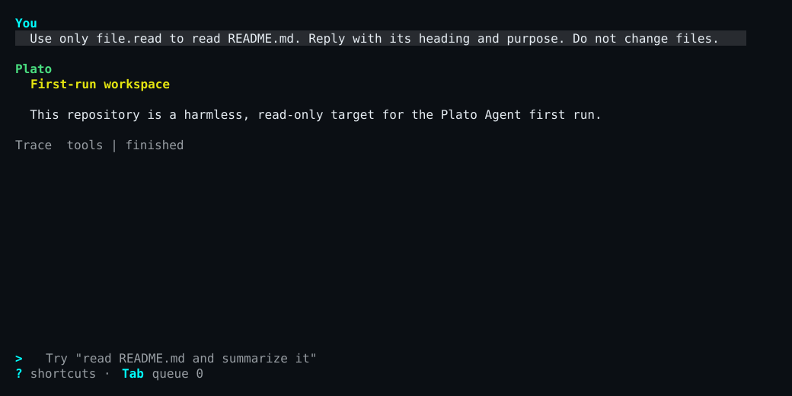

<p class="section-kicker user">User docs</p>

This is one linear OpenRouter journey through Platonic 0.2.2. It uses the
built-in configuration and `OPENROUTER_API_KEY`; do not add a `plato.toml` for
this path.

> **Release track:** Install the supported 0.2.2 bundle with the
> [tagged quickstart](https://github.com/referential-ai/platonic/blob/platonic-v0.2.2/docs/QUICKSTART.md).
> Keep its tag, target, checksum, and commands together.

## 1. Install the 0.2.2 commands

Follow the tagged quickstart for your supported target, then keep its install
directory on this terminal's `PATH`:

```bash
export PATH="$HOME/.local/bin:$PATH"
platonic --version
plato --version
plato-tui --version
```

**Checkpoint:** each line contains the exact 40-character commit and UTC build
date. `platonic` reports product version 0.2.2; the two Plato Agent clients
retain their independent package version 0.2.0. `platonic` keeps its commit and
date in parentheses. Keep this terminal's `PATH` for the rest of the journey.

<figure class="expected-output">
  <figcaption>
    Stable version shape
    <span>Underlined provenance values come from the exact source commit and UTC build date.</span>
  </figcaption>
  <pre tabindex="0"><samp>platonic 0.2.2 (<var>&lt;source-commit&gt;</var>, <var>&lt;YYYY-MM-DD&gt;</var>)
plato 0.2.0 <var>&lt;source-commit&gt;</var> <var>&lt;YYYY-MM-DD&gt;</var>
plato-tui 0.2.0 <var>&lt;source-commit&gt;</var> <var>&lt;YYYY-MM-DD&gt;</var></samp></pre>
</figure>

## 2. Give the server its OpenRouter credential

Create an [OpenRouter API key](https://openrouter.ai/settings/keys) and save
only that key in a private file outside the workspace. In the terminal that
will run the server, read it into the documented environment boundary without
printing it:

```bash
chmod 0600 "$HOME/.config/platonic/openrouter-key"
IFS= read -r OPENROUTER_API_KEY < "$HOME/.config/platonic/openrouter-key"
export OPENROUTER_API_KEY
test -n "$OPENROUTER_API_KEY" && printf '%s\n' 'OpenRouter key: available (value not shown)'
```

**Checkpoint:** the last command prints only:

<figure class="expected-output">
  <figcaption>
    Literal stable output
    <span>No credential value appears.</span>
  </figcaption>
  <pre tabindex="0"><samp>OpenRouter key: available (value not shown)</samp></pre>
</figure>

The secret belongs in the `platonic serve` environment. Do not put it in the
workspace, a command argument, a transcript, or a log. Server-run shell tools
receive a scrubbed environment and do not inherit provider credentials.

## 3. Start Platonic

Keep the credential terminal open and start the one host server in the
foreground:

```bash
platonic serve
```

**Checkpoint:** before waiting for clients, the server prints these two lines;
the socket prefix varies by host:

<figure class="expected-output">
  <figcaption>
    Stable startup shape
    <span>The underlined runtime directory varies by host.</span>
  </figcaption>
  <pre tabindex="0"><samp>daemon_scope: host
socket_path: <var>&lt;runtime-directory&gt;</var>/platonic/host/agent.sock</samp></pre>
</figure>

Leave this process running. The server, not the TUI, owns provider calls,
tools, approvals, and ledger writes.

## 4. Create and register a workspace

In a second terminal, make a harmless Git repository with one committed file:

```bash
mkdir -p "$HOME/platonic-first-run"
cd "$HOME/platonic-first-run"
git init
printf '%s\n' \
  '# First-run workspace' \
  '' \
  'This repository is a harmless, read-only target for the Plato Agent first run.' \
  > README.md
git add README.md
git -c user.name='Platonic First Run' \
  -c user.email='first-run@invalid' commit -m 'Initial workspace'

platonic workspace create first-run "$PWD"
platonic status --workspace "$PWD"
```

**Checkpoint:** `workspace create` returns one JSON object whose `workspace`
contains a stable `id`, the canonical `root`, a `ledger_path`, and
`"health":"present"`. In the following status JSON, check the `model` object
without exposing the key:

<figure class="expected-output">
  <figcaption>
    Stable status excerpt
    <span>The model object is reformatted; surrounding status fields are omitted.</span>
  </figcaption>
  <pre tabindex="0"><samp>{
  "requested_alias": "~openai/gpt-latest",
  "served_model": null,
  "provider_kind": "open_router",
  "key_present": true
}</samp></pre>
</figure>

`served_model` is `null` because this clean workspace has not completed a
provider response yet.

## 5. Create a profile and approve its home

From the registered workspace, run the client with no question or subcommand:

```bash
plato
```

On first use, Plato Agent asks for a profile name. Press `Enter` to accept the
workspace directory name. It creates that workspace-bound profile from the
resolved provider and tool defaults, then proposes the profile's one durable
home with workspace-write authority. The generated profile and thread ids vary:

<figure class="expected-output">
  <figcaption>
    Stable first-use prompt
    <span>The underlined ids are minted by the server.</span>
  </figcaption>
  <pre tabindex="0"><samp>Profile name [platonic-first-run]:
Profile: platonic-first-run (<var>&lt;profile-id&gt;</var>)
profile.open <var>&lt;thread-id&gt;</var> (WorkspaceWrite): profile.open requires approval before authority is created
Approve profile home? [y/N/c]</samp></pre>
</figure>

Type `y` and press Enter. This approves creation of the durable home; it does
not approve every future tool call. Plato Agent prints
`Home: <thread-id> (created)` before entering the TUI.

**Checkpoint:** the Plato Agent TUI opens with an empty transcript and the
composer ready for input.

## 6. Complete one read-only task

Submit this exact task in the composer:

```text
Use only file.read to read README.md. Reply with its Markdown heading and the purpose sentence below it. Do not change files.
```

**Checkpoint:** the transcript shows your task, a successful `file.read` tool
step, and a final answer containing both of these facts:

<figure class="expected-output">
  <figcaption>
    Required answer facts
    <span>The provider may format or add text; these two facts must appear.</span>
  </figcaption>
  <pre tabindex="0"><samp>First-run workspace
This repository is a harmless, read-only target for the Plato Agent first run.</samp></pre>
</figure>

<figure style="break-inside: avoid;">
<div role="region" aria-label="Scrollable first task TUI capture" tabindex="0" style="overflow-x: auto;">
<div style="min-width: 50rem;">



</div>
</div>
<figcaption>A completed read-only turn foregrounds the result while keeping the tool step available in audit and replay.</figcaption>
</figure>

`file.read` is read-only and auto-allowed, so no tool-approval panel appears.
After the answer finishes, press `q` with an empty composer to leave the TUI,
then verify that the repository is unchanged:

```bash
git status --short
```

**Checkpoint:** `git status --short` prints nothing.

## 7. Inspect profile, status, transcript, and replay

List the profile and copy its `id`, then inspect its current revision. List the
durable threads and copy the home `authority.thread_id`:

```bash
platonic profile list
profile_id=<paste-profile-id>
platonic profile status "$profile_id"
plato thread list
thread_id=<paste-thread-id>
plato thread status "$thread_id"
```

**Checkpoint:** profile status reports `home_thread_id` equal to `thread_id` and
revision `1`. Thread status reports `"thread_kind":"home"`, that profile id,
and the working directory under `authority`. After the completed task,
`live.loaded` is `true` and `live.current_turn_id` is `null`.

Reattach to the same live thread:

```bash
plato --remote "$thread_id"
```

**Checkpoint:** the TUI reloads the task, `file.read` step, and final answer.
Press `q` again after inspecting it.

Now read the workspace ledger:

```bash
plato replay
```

**Checkpoint:** replay begins with a `session_id` and `run_id`, includes
`final_phase: Finished`, the user message, `tool_call file.read`, its tool
result, and the final assistant message. Replay is read-only: it performs no
provider request and runs no tool.

## 8. Prove the restart boundary

Stop the idle server, then replay with the credential removed from this child
command:

```bash
platonic shutdown --workspace "$PWD"
env -u OPENROUTER_API_KEY plato replay
```

**Checkpoint:** shutdown prints `{"result":"shutdown"}`, and offline replay
still prints the same finished run.

Start `platonic serve` again from the credential terminal. In the workspace
terminal, inspect the same records, then reopen Plato Agent:

```bash
platonic status --workspace "$PWD"
platonic profile status "$profile_id"
plato thread list
plato replay
plato
```

**Checkpoint:** before `plato` starts, the same home appears with
`live.loaded:false` because live execution state belongs to one server process.
Plato Agent selects the existing profile without another creation or approval
prompt, prints `Home: <thread-id> (reused)`, and attaches that same home. Submit
`Reply with exactly: home reused.` and verify the new turn completes. This loads
the durable home into the new server process without minting another root.

## Verified 0.2.2 released-product proof

The public [#588 completion record](https://github.com/referential-ai/platonic/issues/588#issuecomment-5309518721)
is the source for this redacted journey. Credential values, local paths, exact
effect bytes, and minted thread and run ids are omitted here.

1. **Install.** The proof used the published [Platonic 0.2.2
   bundle](https://github.com/referential-ai/platonic/releases/tag/platonic-v0.2.2),
   built from the exact tagged source.
2. **Bounded task.** One profile home dispatched one child with fewer worktrees
   and tools, no network authority, and one local approval for the admitted
   effect.
3. **Restart and reuse.** A zero-effect child run was interrupted by a server
   restart. Recovery reused the durable child authority and exact committed
   parent follow-up, completed the effect once, and returned one typed result.
4. **Replay.** Offline `plato replay` verified the spawn, follow-up,
   interruption, recovery, and parent-consumption runs without provider or tool
   IO. The parent consumed the typed return without repeating the effect.

## Recover by symptom

| Symptom | Recovery |
| --- | --- |
| A 0.2.2 archive download returns HTTP 404 | Use the exact `platonic-v0.2.2` tag and target name from the tagged quickstart; no other targets are published. |
| `platonic serve` reports a missing provider key, or status shows `"key_present":false` | Stop the idle server. Load `OPENROUTER_API_KEY` in the terminal that will own `platonic serve`, verify only that it is nonempty, and restart the server. |
| `plato` reports `workspace_unregistered` | Return to the intended Git repository and run `platonic workspace create first-run "$PWD"` once. If the name is already used, inspect `platonic workspace list` instead of creating a competing record. |
| Profile creation reports that the provider key is unavailable | Load the configured key into the `platonic serve` environment, restart the idle server, and rerun bare `plato`. No incomplete profile row is retained. |
| Home creation reports that the directory is not a Git repository or has no usable commit | Complete the `git init`, `git add`, and initial commit commands above, then rerun bare `plato`. |
| `profile home denied` appears | Review the proposed home authority. To retry a deliberate denial, use `platonic profile open PROFILE_ID --idempotency-key NEW_KEY --approve`; do not edit server state. |
| The task fails before a final answer | Check `platonic status --workspace "$PWD"`. Confirm `provider_kind` is `open_router` and `key_present` is `true`; then reopen the same profile home and submit a deliberate new turn. The failed attempt remains in the ledger. |
| `plato replay` reports no sessions | Finish one task from this registered workspace first. Replay selects that workspace's latest recorded session. |

Continue with the [User operations guide](../operations/) for daily operation,
approvals, and provider choices, or the [Developer guide](../../developer/) for
server, protocol, and ledger internals.
