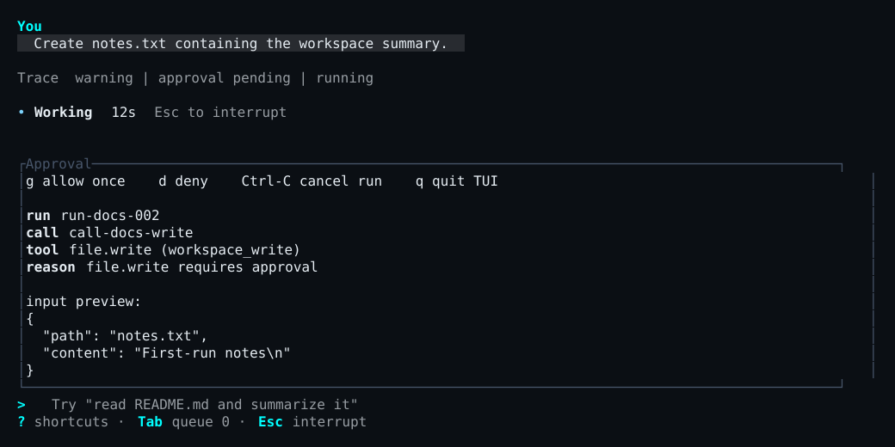

<p class="section-kicker user">User docs</p>

This page is part of the [unreleased 0.2.0 operating guide](../).

The Platonic server evaluates every tool proposal against server-owned run limits: the configured toolset, any durable thread path and network grants, and the applicable approval policy and profile. A client can answer a prompt; it cannot widen those limits.

## Decide from the proposed effect

In the TUI, the approval pane shows the tool, reason, effect class, and a bounded preview. Read the command, path, URL, working directory, and timeout before deciding.

<figure style="break-inside: avoid;">
<div role="region" aria-label="Scrollable approval TUI capture" tabindex="0" style="overflow-x: auto;">
<div style="min-width: 50rem;">



</div>
</div>
<figcaption>Review one proposed effect before choosing: the pane binds the decision to this run, tool call, path, and preview.</figcaption>
</figure>

| Key | Decision |
| --- | --- |
| `g` | Grant this request once |
| `s` | Grant this exact `shell.exec` request and later shell calls in this session until the server exits |
| `d` | Deny this request |
| `Esc` | Cancel the active run |
| `q` | Exit the TUI without resolving the pending request |

The `s` action is available only for `shell.exec`. Its grant is limited to the selected session and current server lifetime. It does not apply to another session or survive a server restart.

One-shot mode prompts `approve TOOL (REASON)? [y/N]`. Only `y` or `yes` grants; every other answer denies.

## Know the shipped defaults

| Proposal | Default result |
| --- | --- |
| Enabled read-only file operation | Allowed |
| Enabled workspace write | Requires approval |
| Exact enabled `shell.exec` | Requires explicit local approval |
| Exact enabled `web.fetch` | Requires explicit local approval |
| Disabled or unknown tool | Denied |
| Secret access or an otherwise denied effect | Denied |

An approval prompt is not proof that an operation is harmless. It means the server has admitted a bounded decision point inside the authority already assigned to the thread.

## Use yolo narrowly

Yolo mode auto-grants only server-classified, approval-required workspace writes and the exact shipped `shell.exec` tool. A direct write or edit of root `PLATONIC.md` still prompts.

Yolo never auto-grants `web.fetch`, network effects, secret access, arbitrary external-side-effect tools, a disabled or unknown tool, or a server denial. It cannot expand a thread's toolset, worktrees, granted paths, or network authority.

Start a one-shot or new local TUI session in yolo mode with `--yolo`. In the TUI, `/yolo on` and `/yolo off` change the selected session's profile for the current server lifetime. Before an unattached session exists, the command selects the profile for its next fresh run. These commands do not rewrite a thread's immutable approval policy; a thread explicitly admitted under the `yolo` policy remains governed by that policy.

```bash
plato --yolo "apply the requested edits and run the focused tests"
```

`--yolo` cannot be combined with `--remote`. After attaching, use `/yolo on` only when the narrower behavior above is appropriate. The footer and `/status` show the selected session's live profile.

Approval grants and denials are recorded in the ledger. Inspect them with `v`, `/status`, or [offline replay](../history-and-recovery/#read-durable-history). For the architectural authority boundary, see [runtime boundaries](../../../developer/runtime-boundaries/).
