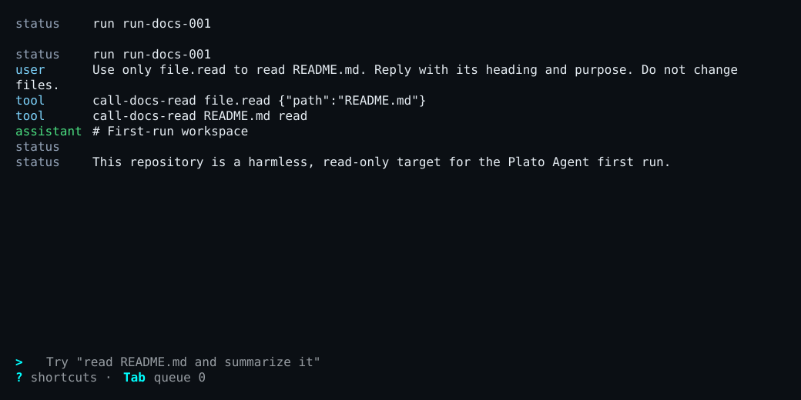
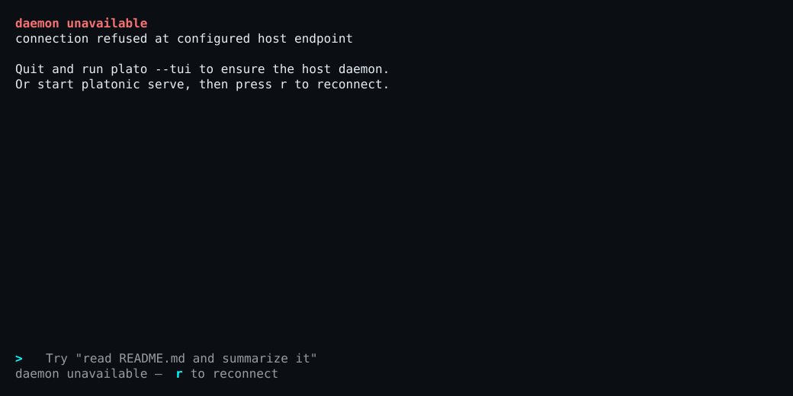

<p class="section-kicker user">User docs</p>

This page is part of the [Platonic 0.2.2 operating guide](../).

## What persists

The server records workspace sessions and run indexes in SQLite and writes each run's ordered events to a JSONL log. On Unix, the default state root is `${XDG_STATE_HOME:-$HOME/.local/state}/platonic`:

```text
server.db
workspaces/<workspace-id>/ledger.db
workspaces/<workspace-id>/runs/<run-id>.jsonl
```

Use the ledger path printed by one-shot completion or returned by `/status` and `platonic status` instead of guessing a workspace ID. The server owns these files. Do not edit or delete its databases, logs, sidecars, locks, or worktrees as a recovery step.

## Read durable history

`plato replay` is read-only and offline. It does not start or contact the server, call a provider, or execute a tool.

```bash
plato replay
plato replay --run RUN_ID
plato replay /path/to/run.jsonl
plato replay --db=/path/to/ledger.db --run RUN_ID
```

With no run ID, replay resolves the registered workspace through the read-only server registry, selects the latest session, and prints its runs in order. `--run` selects one run from a SQLite ledger. A direct JSONL file cannot be combined with `--run` or `--db`.

Replay reports committed messages, tool and approval facts, final phase, and the next event sequence. Provider streaming deltas are transient and are not replay output. An incomplete final JSONL line is ignored because it was not committed.

<figure style="break-inside: avoid;">
<div role="region" aria-label="Scrollable audit TUI capture" tabindex="0" style="overflow-x: auto;">
<div style="min-width: 50rem;">



</div>
</div>
<figcaption>The audit view makes the committed sequence legible; offline replay exposes those durable facts without contacting the server.</figcaption>
</figure>

## Reconnect a TUI

An I/O or protocol failure leaves the TUI disconnected rather than silently starting a replacement server. Restore the existing server first, then press `r` or run `/reconnect`. The client reloads the selected transcript, thread events, and any pending approval while preserving the composer.

The standalone `plato-tui` client never starts, restarts, or stops the server. Bare `plato` only ensures the server during initial startup; it does not replace a server after a live TUI disconnects.

<figure style="break-inside: avoid;">
<div role="region" aria-label="Scrollable recovery TUI capture" tabindex="0" style="overflow-x: auto;">
<div style="min-width: 50rem;">



</div>
</div>
<figcaption>A disconnect stays visible and recoverable: restore the existing server, then reconnect without deleting durable state.</figcaption>
</figure>

A server restart preserves registered workspaces, profiles, thread authority, and committed history, but prior threads initially appear as `unloaded`. Use replay for the old record. Bare `plato` resolves the selected profile's same home, and the next submission loads it for a new turn; it does not claim that an interrupted process resumed.

## Recover by symptom

| Symptom | Bounded diagnosis | Recovery |
| --- | --- | --- |
| `daemon unavailable` or TUI shows offline | Run `platonic status --workspace "$PWD"` once. | If no server is running, start `platonic serve` in a separate terminal. Then use `r` or `/reconnect`. |
| `daemon lock held` when starting `platonic serve` | The error identifies the existing owner. Check it with `platonic status --workspace "$PWD"`. | Use the existing server. If it is idle and you intend to stop it, use `platonic shutdown --workspace "$PWD"`. A crashed owner's stale lock is recovered by normal startup; do not delete a live lock. |
| `workspace_unregistered` | Run `platonic workspace list` and compare the canonical directory. | Register the intended directory with `platonic workspace create NAME "$PWD"`. Do not edit `server.db`. |
| Status reports `key_present: false` | Check `provider.api_key_env` in the resolved config and whether that variable exists in the server process environment without printing it. | Set the variable in the environment that launches `platonic serve`, then restart the idle server. Never put the credential value in TOML or a diagnostic log. |
| Provider rejects the model or endpoint | Use `/status` or `platonic status` to read `provider_kind`, `requested_alias`, and the served model when reported. Compare the resolved `kind`, `model`, and trusted `base_url`. | Correct the [provider configuration](../../../reference/configuration/#provider-shapes). Use `platonic profile update` for future defaults; existing thread authority does not change. |
| Provider connection or stream stalls | Compare the failure timing with `connect_timeout_ms` and `stream_idle_timeout_ms`. | Correct the endpoint or set a positive bounded timeout in trusted config; do not expose the credential in a connectivity command. |
| Run becomes `interrupted` after a server failure or restart | Reconnect and inspect `/status`, then replay the printed run ID. | Treat committed facts as authoritative. Start a deliberate follow-up turn; do not blindly repeat a tool with external effects. |
| Replay says the run is missing or the ledger/version is invalid | Verify the exact run ID and ledger path from prior output or status. | Use the client from the matching 0.2.2 bundle and the correct registered workspace or explicit ledger. Preserve the rejected data for diagnosis. |
| TUI reports a lagged event stream | Wait for its bounded current-tip reload and inspect the warning or audit view. | If it becomes disconnected, use `r`; otherwise continue from the reloaded committed state. |
| TUI says another controller owns the active turn | Read `plato thread status THREAD_ID` and attach as an observer if needed. | Let the owning controller finish or steer from that controller. Do not reset or delete the thread. |
| Color or animation makes the terminal unreadable | Start once with `NO_COLOR=1 plato` or `plato --reduced-motion`. | Keep the setting that fixes the terminal; no server or ledger reset is needed. |
| Built-in TUI action is unclear | Press `?`, then use `/status` to confirm the selected session and connection. | Follow the current [TUI control reference](../../../reference/operations/tui/). |

If a diagnostic returns an unexpected protocol or persistence error, keep its exact error text, run ID, workspace ID, and ledger path. Redact provider outputs and never capture environment-variable values.
